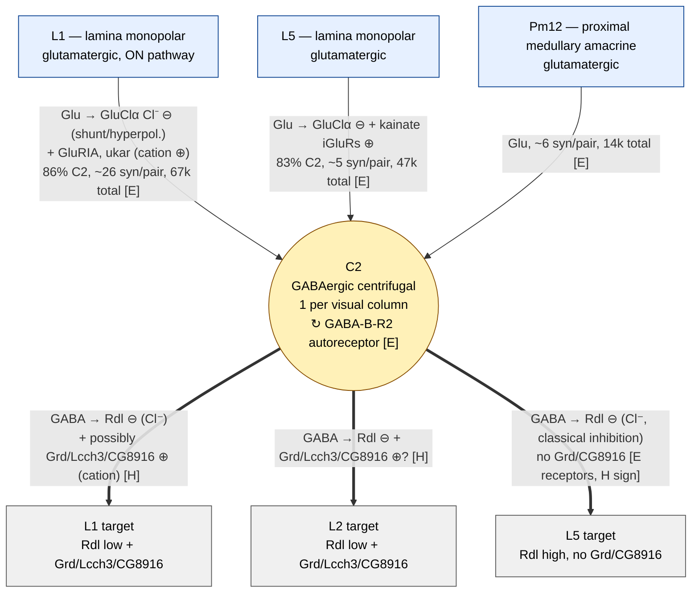

## Circuit summary diagram (vertical)

Vertical version of the C2 circuit summary diagram from
[`C2_glutamatergic_input_report_v2.md`](C2_glutamatergic_input_report_v2.md) §7 —
glutamatergic inputs on top, C2 in the middle, downstream targets below.

### Legend

**Cell colours**
- 🔵 Blue = glutamatergic input neuron
- 🟡 Yellow = GABAergic centrifugal neuron (C2)
- ⚪ Grey = downstream target of C2 (sign of C2 output not yet measured)

**Edge syntax**
`transmitter → receptor sign (effect)` — e.g. `Glu → GluClα Cl⁻ ⊖`.
- ⊖ = inhibitory / hyperpolarising / shunting
- ⊕ = excitatory / depolarising
- Solid thin arrow = afferent (glutamatergic) input to C2
- Solid thick arrow (==>) = GABAergic output of C2
- Dashed loop = autoreceptor / presynaptic feedback

**Evidence tags**
- **[E]** edge: receptor identity is supported by VFB scRNAseq across multiple datasets and the connection by VFB connectomics; in some cases sign of effect is also supported by published physiology (e.g. GluClα is inhibitory in fly olfaction and medulla, Molina-Obando 2019).
- **[H]** edge: the sign / functional effect is a hypothesis built from receptor co-expression patterns, awaiting direct electrophysiology. In particular, whether the C2→L1/L2 GABAergic synapse is purely inhibitory (via Rdl-Cl⁻ channels), depolarising (via Grd/Lcch3-cation channels), or mixed across cells is currently undetermined.

**Source of numbers in edge labels** — VFB `UpstreamClassConnectivity` on C2, aggregated across MaleCNS, FlyWire/FAFB, hemibrain, JRC OpticLobe and BANC connectomes (n=2,667 C2 instances).
